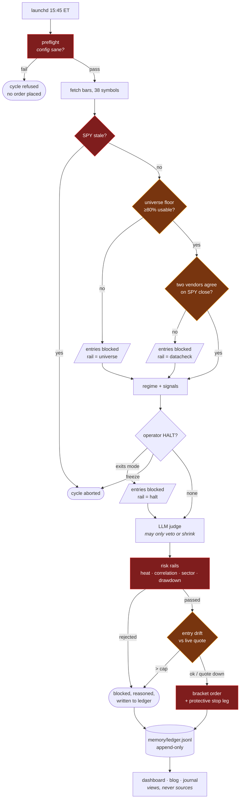

# trading-agent

A swing-trading agent that decides once per day on daily bars, writes down its
reasoning for every decision, and holds itself to pre-registered pass marks it
cannot move after seeing the data.

**It trades paper money only.** Going live needs two independent switches thrown
by hand — `mode: live` in `config.yaml` **and** `LIVE_TRADING_CONFIRMED=YES` in
`.env` (`src/broker.py:44`). Both ship off. No real money is managed, and there
is no product to buy.

---

## What makes this worth reading

Most trading-bot repos are a strategy. This one is mostly a **referee**, because
the strategies kept failing and the interesting problem turned out to be *how
you know*.

**Pre-registration, frozen by hash.** A claim is a YAML file — arms, clauses,
the pass mark, an honest prior, and the ways the result could fool you.
`scripts/register_gate.py` hashes the *parsed* spec (`src/gatespec.py`) and
records the digest **before** the run. `scripts/run_gate.py` then refuses to
score:

1. a spec that was never registered — no frozen pass mark means the result
   could not have been wrong;
2. a spec altered since registration — and the refusal **names the field that
   moved**, because `clauses.2.pp: 1.0 -> 3.0` is the finding while "the spec
   changed" only starts a search;
3. a snapshot whose sha256 is not the one the registration named.

Reformatting is deliberately *not* tampering: the hash tracks meaning, so a
freeze that cried wolf would be one people learned to bypass.

**A divergence register.** `docs/divergences.md` lists every place the simulator
and the live bot were found to differ — **21 as of 2026-08-11**, fourteen closed
by a **named test** and seven open, because "fixed in code" has been
wrong here before. Three of them were found within four days by reading code for
an adjacent task, which is the honest reason the file does not claim to be
complete.

**Negative controls on the guards.** Every guard in this repo has been mutated
to confirm the test protecting it goes red, then restored byte-exact. A guard
nothing can falsify is not a guard.

**2,593 tests as of 2026-08-22**, offline by design — no credentials, ever, in CI.

**Every count on this page is checked, not typed.** `tests/test_doc_counts.py`
regenerates the test count, the divergence total and the open/closed split, and
fails when any drifts — including the numbers in this very paragraph. It exists
because the test figure went stale three times, and on the day it was written it
caught the divergence register's own summary table missing four entries, three
of them open.

**The record is append-only.** `memory/ledger.jsonl` is the source of truth;
the dashboard, blog and journal are views rendered from it.

---

## One cycle, 15:45 ET

The thing worth reading off this diagram is the **polarity** of each guard.
Fail-CLOSED guards stop the trade; fail-OPEN guards let it through and log a
`degradation` against a daily budget. Getting one of those backwards is the most
expensive mistake available here, so they are drawn differently.



**Red = fail-closed** (refuses to trade when it cannot verify). **Amber =
fail-open** (proceeds and logs a `degradation`, counted against
`ops.max_degradations_per_day`). The drift guard is amber on purpose: a quote
outage is not a bad price, and bar freshness already covers that class — which
is precisely why a test fake silently omitting `latest_price` was able to hide
in nine files until 2026-08-06.

Exits are **never** blocked by a data rail. Every one of the three entry blocks
above leaves position management running, because a stranded position is worse
than a missed entry.

---

## What this has and has not shown

This is the section most repos leave out.

**Two EDGE claims in sixteen have passed — and neither survives its own
caveats.** The tally on the register is **2 passes in 16**. §51 ran on the most
survivor-selected universe in the project, carrying **+200.28pp** of
survivorship inflation — large enough to explain the result outright. §72
(trend_hold, latch-off, financed 1.5×) was the **first pass on
survivorship-certified data**, measured with the LLM judge switched off in the
simulator. **§75 re-measured it with the judge on** — the live bot's own
haircut distribution, applied to the same frozen arms and pass mark — and
**one period of four stands**, not three. The prior named that pattern before
the run. Every spec froze the asymmetry before running — *a FAIL is decisive,
a PASS is not* — so the caveats were in place before either pass arrived, and
at K=16 two passes remains a rate consistent with chance. §52 found survivorship-free replication **blocked** and froze the EDGE
budget; §68's pre-committed promotion rule later licensed exactly one
registration, §72 spent it, and the venue re-froze. None of it was quietly
dropped: every claim is written up in `knowledge/backtest_candidates.md` with
the verdict, the frozen prior, and what the result did and did not license.
That file carries the running count and is the only place it is kept.

**The shipped configuration fails its own gate.** §43 pointed
`backtest.enablement_gate` — the function that rejected every candidate — at the
strategies actually running, across four periods spanning 26 years, on the first
simulator that models what the live bot does. It failed **all four**:

| period | return | exposure-matched bar | margin |
|---|---|---|---|
| 2000–2006 | +9.45% | +29.02% | −19.57pp |
| 2007–2013 | +2.42% | +10.10% | −7.68pp |
| 2014–2019 | +56.71% | +62.61% | −5.90pp |
| 2022–2026 | −7.71% | +2.13% | −9.84pp |

The bar is buy-and-hold scaled to the exposure the bot actually carried — the
fair comparison for a bot that spends most of its time in cash.

Both columns come from the same survivor-selected universe, so the comparison is
fair on its own terms (§48) — but neither number is what a real account would
have seen. Over the identical 2000–2006 bars the snapshot's universe returned
+138.74% while SPY returned **+8.68%**. §51 sized the same effect at
**+200.28pp** on the 38-name universe.

**The one historical pass was an artifact.** 2014–2019 was the only period this
bot ever cleared its own gate. It cleared it on a simulator that did not model
the LLM judge, which downsizes 58% of live buys. With the judge modelled the
same period fails by 5.90pp. That is §42 and §43, and it took the count from
one-in-four to zero-in-four.

**There is no validated way to pick a winner here.** §34 tested the *selection
procedure itself*: single-split, fold-majority, and an oracle with the future in
hand all scored about the same as random. So a strategy that looks best on this
data cannot be trusted to be best, and the programme is allowed to reject but
not yet to accept.

**Live record: 14 closed round-trips as of 2026-08-18**, first close 2026-07-21 —
+16.78%, +10.67%, +6.40%, −8.59%, −3.67%, −5.61%, +2.33%, +0.04%, +0.18%, −2.09%,
−1.63%, −4.49%, −4.14%, −7.27%. Realized **−$1,092.74**, profit factor **0.27**.

**Six of the fourteen won, and it still lost money** — the losers were bigger.
That pair of facts is why a win rate is not reported here on its own, and it is
the kind of number a hit-rate headline is built to hide. The three closes since
2026-08-11 were all losers, which is why the profit factor fell further, from
0.33 to 0.27, while the win count did not move at all — the clearest
illustration on record of why a hit rate is not a result.

**n=10 decides nothing** in either direction, and no average of ten numbers
belongs in a README. Going live is gated behind **≥30 closed trades, ≥60 days,
and attorney review**, and at the current rate that is months away.

> **No performance number appears in this repo without its benchmark and its
> sample size.** That rule is why the table above has a bar column and why the
> live record has an `n`.

---

## Layout

| path | what it is |
|---|---|
| `GUIDE.md` | build-from-zero setup walkthrough |
| [`GLOSSARY.md`](GLOSSARY.md) | §N, divergence, enablement gate, exposure-matched bar, fail-open vs fail-closed |
| [`research/INDEX.md`](research/INDEX.md) | generated one-line-per-§ table of the research record |
| `knowledge/backtest_candidates.md` | the research record — every claim, prior, and verdict |
| `knowledge/principles.md` | the rules the project holds itself to |
| `research/specs/`, `registrations.jsonl`, `verdicts.jsonl` | frozen specs, their hashes, and what they returned |
| `docs/divergences.md` | simulator-vs-live differences and the test closing each |
| `docs/` | runbooks, SLOs, incident response, secret rotation, go-live checklist |
| `src/risk.py` | every rail; the live bot and the backtester call the same function |
| `src/backtest.py` | the simulator (`simulate_ensemble` is the one gates use) |
| `scripts/run_gate.py` | executes a frozen registration and records the verdict |

## Running it

Setup is in [GUIDE.md](GUIDE.md). Briefly:

```bash
python3.11 -m venv .venv && .venv/bin/python -m pip install -r requirements.lock
cp .env.example .env                  # add your Alpaca PAPER keys
.venv/bin/python -m pytest tests/ -q  # 2593, offline, no keys needed
.venv/bin/python -m src.deploycheck   # is the running code the reviewed code?
.venv/bin/python src/main.py          # one cycle
```

Preflight is not a separate command — `src/preflight.py` runs inside every
cycle (`src/main.py:576`) and **fails the cycle closed** if the config is
unsafe, which is the opposite polarity from `deploycheck` (fail-open, advisory).
A clean start prints nothing from it; a bad one prints `PREFLIGHT: <reason>` and
stops before any order.

`requirements.lock` pins all 58 packages including transitive ones. That matters
more than usual here: `numpy` and `pandas` arrive through the closure, nothing
names them, and a float changing in the last place is enough to move a profit
factor across an enablement threshold. **Bumping a pin is a change that must be
followed by re-running a frozen gate and confirming the recorded numbers still
reproduce.**

## Licence and disclaimer

Apache-2.0 — see [LICENSE](LICENSE).

**Nothing here is financial advice.** This is a research project that trades
simulated money and has not demonstrated an edge. Do not point it at an account
you care about.
